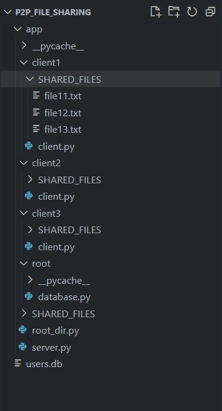
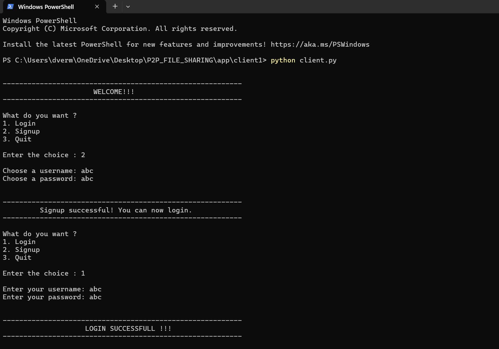
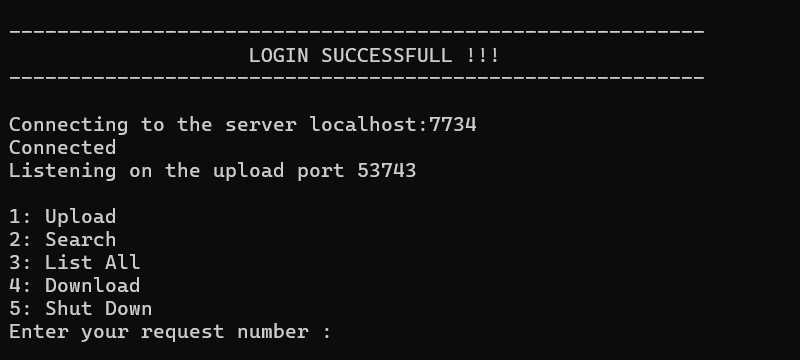
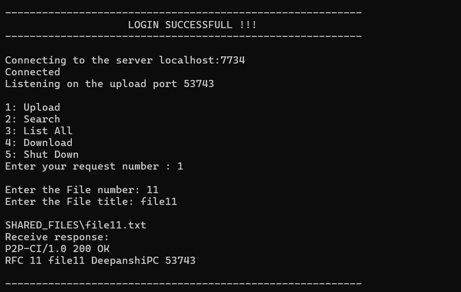
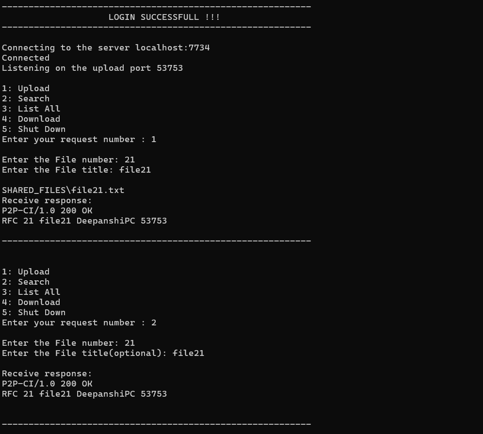
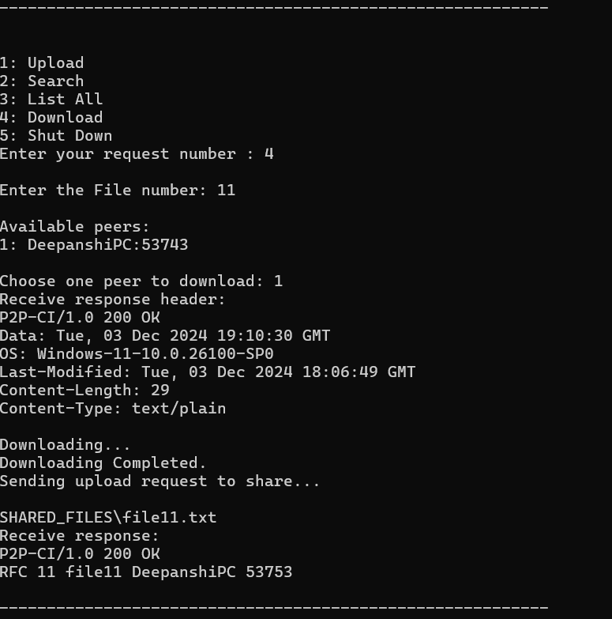
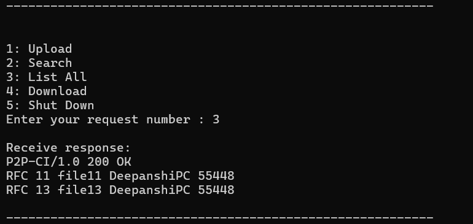
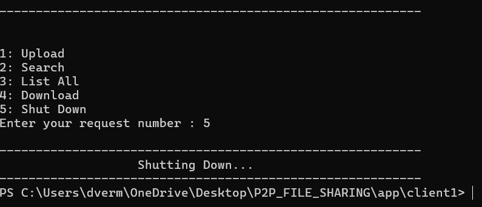

# P2P File Sharing Application

## Overview
This is a Peer-to-Peer (P2P) File Sharing application built in Python, featuring user authentication via SQLite and a comprehensive file sharing system with multiple functionalities.

## Screenshots

### Directory Structure


### Login Screen


### Main Menu


### File Upload


### File Search


### Download Process


### List All Files


### Shutdown Confirmation


## Features
- User Authentication (Login/Signup)
- RFC (Request for Comments) File Sharing
- Peer Discovery
- File Upload
- File Search
- File Download
- Shareable File Repository

## Technologies Used
- Python
- Socket Programming
- SQLite
- Threading
- Platform-independent Design

## Prerequisites
- Python 3.7+
- Standard Python Libraries (socket, threading, sqlite3)

## Project Structure
```
P2P_FileSharingSystem/
│
├── server.py            # Main server implementation
├── client.py            # Main client implementation
├── root_dir.py          # Root directory configuration
├── SHARED_FILES/        # Default directory for shared files
├── screenshots/         # Screenshots of application
└── README.md            # Project documentation
```

## Setup and Installation

1. Clone the Repository
```bash
git clone https://github.com/deepanshi211/P2P_FileSharingSystem.git
cd P2P_FileSharingSystem
```

2. Install Dependencies
```bash
# No additional dependencies required
# Ensure you have Python 3.7+ installed
```

3. Run the Server
```bash
python server.py
```

4. Run the Client
```bash
python client.py
```

## User Workflow

### Authentication
1. Run the client application
2. Choose between Login, Signup, or Quit
3. After successful authentication, access the main menu

### Main Menu Options
1. **Upload**: Share a file with the P2P network
2. **Search**: Find files by RFC number
3. **List All**: View all available files in the network
4. **Download**: Download files from peers
5. **Shut Down**: Exit the application

## Security Notes
- Passwords are stored in SQLite database
- Basic authentication mechanism
- Recommended to enhance security in production

## Contributing
1. Fork the repository
2. Create your feature branch
3. Commit your changes
4. Push to the branch
5. Create a new Pull Request

## Project Conclusion

### Learning Outcomes
This Peer-to-Peer File Sharing project serves as an excellent demonstration of distributed systems principles, showcasing:
- Practical implementation of socket programming
- User authentication mechanisms
- Distributed file discovery and sharing
- Concurrent network communication using threading

### Reflection
This project provides a foundational understanding of how peer-to-peer networks operate, demonstrating the power of decentralized file-sharing systems. It highlights the importance of network programming, concurrent processing, and distributed system design.

By breaking down complex networking concepts into manageable components, this application serves as both a learning tool and a proof of concept for distributed file-sharing technologies.

## Demo Video
[](https://youtu.be/Nq_jHiZL_L4?si=TPDELcCtJhgK92jE)

### Video Walkthrough
- Full demonstration of the P2P File Sharing application
- Showcases user authentication process
- Detailed explanation of file upload and download mechanisms
- Illustrates peer discovery and file sharing functionality
- Walkthrough of main menu and application workflow
